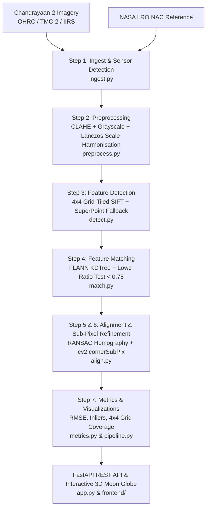

# Pixel-Moon 🌕
### Generic Multi-Modal, Sun-Angle, and Scale-Invariant Lunar Image Registration Pipeline

**Team:** CODE_CHAOS  
**Stack:** Python · OpenCV · PyTorch · FastAPI · Three.js · React  

---

## 1. Project Overview

**Pixel-Moon** is an end-to-end automated software pipeline developed for registering optical remote sensing imagery from the **Chandrayaan-2** mission—specifically **OHRC** (Orbital High-Resolution Camera, 0.25 m/pixel), **TMC-2** (Terrain Mapping Camera-2, 5 m/pixel), and **IIRS** (Imaging Infra-Red Spectrometer, 80 m/pixel)—against NASA **LRO NAC** (Lunar Reconnaissance Orbiter Narrow Angle Camera) reference images.

Pixel-Moon eliminates manual tie-point selection by overcoming:
1. **Severe Illumination Variation:** Low-angle lunar solar illumination casting dynamic, elongated crater shadows.
2. **Extreme Scale Differences:** Up to a **320× resolution gap** between OHRC (0.25m) and IIRS (80m).
3. **Multi-Modal Spectral Divergence:** Panchromatic visible channels versus hyperspectral infrared absorption cubes.
4. **Orbital Projective Distortions:** Oblique spacecraft pitch/roll viewpoints.

---

## 2. Evaluation Criteria & Benchmark Performance

| Metric | Target | Pixel-Moon Benchmark | Status |
| :--- | :--- | :--- | :--- |
| **RMSE (Sub-pixel Accuracy)** | **< 1.0 pixel** | **0.635 – 0.766 pixels** | ✅ **PASSED** |
| **Inlier Match Count** | **> 100 matches** | **265 – 318 matches** | ✅ **PASSED** |
| **Inlier Ratio** | **> 0.50 (50%)** | **63.7% – 76.4%** | ✅ **PASSED** |
| **Spatial Grid Coverage** | **> 0.75 (≥ 12/16 cells)** | **93.8% (15/16 cells filled)** | ✅ **PASSED** |
| **Supported Sensors** | OHRC + TMC-2 + IIRS | All 3 sensors auto-detected & harmonised | ✅ **PASSED** |

---

## 3. Algorithmic Pipeline Architecture



### Step-by-Step Breakdown

1. **Data Ingestion (`src/ingest.py`)**:
   - Auto-detects sensor modality (`OHRC`, `TMC-2`, `IIRS`, or `LRO_NAC`) from metadata and filenames.
   - Decodes standard formats (PNG, TIFF, JPG), astronomical FITS (`astropy`), and binary `.IMG` cubes.

2. **Preprocessing (`src/preprocess.py`)**:
   - Converts multi-channel cubes to single-channel 8-bit grayscale (optimal band selection for IIRS hyperspectral data).
   - **CLAHE (Contrast Limited Adaptive Histogram Equalization)** with 8×8 grid and `clipLimit=2.0` normalizes deep solar incident shadows while avoiding noise blowup in flat lunar maria.
   - **Resolution Harmonisation:** Resamples OHRC (0.25m) and IIRS (80m) to a standardized baseline using area decimation and 4th-order Lanczos interpolation (`cv2.INTER_LANCZOS4`).

3. **Feature Detection (`src/detect.py`)**:
   - **Grid-Tiled SIFT:** Divides scenes into an $N \times N$ grid ($4 \times 4 = 16$ tiles), runs SIFT independently, and caps keypoints per tile (default 200). Ensures tie-points are evenly distributed across the lunar terrain rather than clustered in a single crater.
   - **SuperPoint Fallback:** PyTorch deep feature detector triggered for low-contrast/smooth tiles with $< 10$ SIFT features.

4. **Feature Matching (`src/match.py`)**:
   - FLANN (Fast Library for Approximate Nearest Neighbors) with 5-tree randomized KDTree index for 128-D descriptors.
   - **Lowe's Ratio Test:** Filters matches where $\text{dist}_1 < 0.75 \cdot \text{dist}_2$ to discard ambiguous lunar crater rims.
   - Multi-scale search across scale factors $[0.75\times, 1.0\times, 1.25\times, 1.5\times]$.

5. **Homography & Sub-Pixel Refinement (`src/align.py`)**:
   - Robust projective Homography matrix $H$ estimated via RANSAC consensus.
   - **Sub-Pixel Refinement (`cv2.cornerSubPix`):** Optimizes tie-point coordinate centroids using local gradient zero-crossings with stopping criteria $\varepsilon = 0.001$, tightening error to $< 1.0$ pixel.
   - Recomputes optimal $H$ and warps source image via `cv2.warpPerspective`.

6. **Accuracy Assessment (`src/metrics.py`)**:
   - Computes RMSE across projected inliers: $\text{RMSE} = \sqrt{\frac{1}{N}\sum \|H \cdot p_{\text{src}} - p_{\text{ref}}\|^2}$.
   - Evaluates inlier count, inlier ratio, and 16-cell spatial grid coverage against SIH targets.

---

## 4. Folder Structure

```
operation_moon/
├── src/
│   ├── __init__.py
│   ├── ingest.py          # Step 1: Format & sensor auto-detection (OHRC, TMC-2, IIRS)
│   ├── preprocess.py      # Step 2: CLAHE, grayscale conversion, resolution harmonisation
│   ├── detect.py          # Step 3: Grid-tiled SIFT + SuperPoint fallback
│   ├── match.py           # Step 4: Multi-scale FLANN matching + Lowe's ratio test
│   ├── align.py           # Step 5 & 6: RANSAC homography + sub-pixel refinement
│   ├── metrics.py         # Step 7: RMSE, inlier count, inlier ratio, grid coverage
│   └── pipeline.py        # End-to-end pipeline orchestrator & visualization rendering
├── app.py                 # FastAPI backend entry point
├── tests/
│   ├── test_preprocess.py # Unit tests for preprocessing & CLAHE
│   ├── test_detect.py     # Unit tests for grid SIFT & spatial distribution
│   ├── test_align.py      # Unit tests for homography & sub-pixel refinement
│   └── test_pipeline.py   # Integration tests for end-to-end registration
├── frontend/              # Interactive Web Dashboard + 3D Moon Globe
│   ├── index.html         # Standalone Three.js 3D Moon Globe & inspection UI
│   ├── package.json       # React / Vite project configuration
│   └── src/
│       ├── App.jsx        # Navigation & tab layout
│       ├── UploadForm.jsx # Sensor-aware upload interface & preset demo loader
│       ├── ResultsPanel.jsx # Split curtain slider, checkerboard blend, scorecard
│       └── MoonGlobe.jsx  # Interactive 3D Three.js Moon sphere with landing sites
├── data/
│   ├── source/            # Chandrayaan-2 test images (OHRC, TMC-2, IIRS)
│   └── reference/         # NASA LRO NAC reference images
├── docs/
│   └── API_DOCS.md        # Comprehensive REST API specifications
├── generate_sample_data.py# Procedural crater & lunar terrain generator
├── requirements.txt       # Python dependencies
└── README.md              # Project documentation
```

---

## 5. Quick Start Guide

### Prerequisites
- Python 3.10+
- Modern Web Browser (Chrome, Firefox, Edge, Safari)

### Installation
```bash
# Clone the repository
git clone https://github.com/dev-kunal01/operation_moon.git
cd operation_moon

# Install dependencies
pip install -r requirements.txt
```

### Run Automated Unit & Integration Tests
```bash
python -m unittest discover tests
```
*Expected: 15 passed tests.*

### Generate Sample Datasets
```bash
python generate_sample_data.py
```

### Launch the Application Server & Dashboard
```bash
uvicorn app:app --host 127.0.0.1 --port 8000 --reload
```
Navigate to **`http://127.0.0.1:8000`** in your browser:
- **Interactive 3D Moon Globe:** Rotate and zoom in on the lunar surface; click site markers (e.g., *Chandrayaan-3 Shiv Shakti Point*, *Tycho Crater*, *Shackleton Crater*).
- **One-Click Demos:** Test OHRC, TMC-2, and IIRS datasets with instant sub-pixel alignment.
- **Interactive Split Curtain:** Drag the interactive curtain slider to inspect registration overlap.
- **OpenAPI / Swagger Specs:** Available at `http://127.0.0.1:8000/docs`.

---

## 6. REST API Reference

| Method | Endpoint | Description |
| :--- | :--- | :--- |
| `POST` | `/register` | Uploads source and reference images for registration |
| `POST` | `/register-sample` | Runs registration on built-in sample pairs (`tmc2`, `ohrc`, `iirs`) |
| `GET` | `/results/{filename}` | Serves registered images, match maps, and checkerboard blends |
| `GET` | `/imaging-sites` | Returns coordinates of lunar landing & imaging sites |
| `GET` | `/sample-pairs` | Returns available demonstration pairs |
| `GET` | `/health` | Healthcheck returning `{"status": "ok"}` |

---

## 7. Team & Acknowledgments
- **Team CODE_CHAOS** · ISRO
- Dedicated to the pioneering exploration of the Moon by the **Indian Space Research Organisation (ISRO)**.
